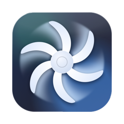
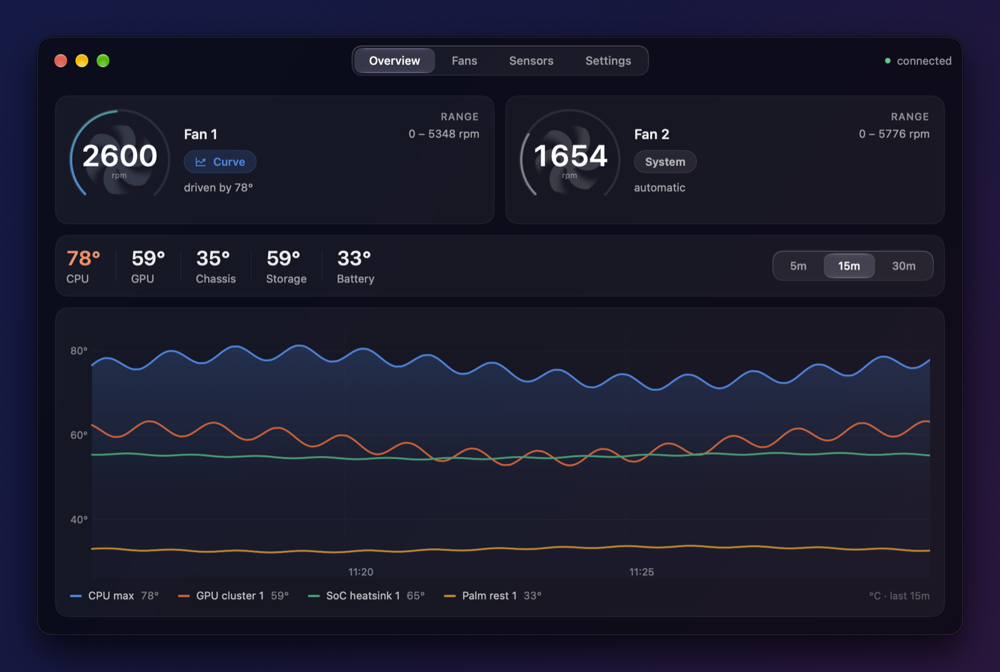
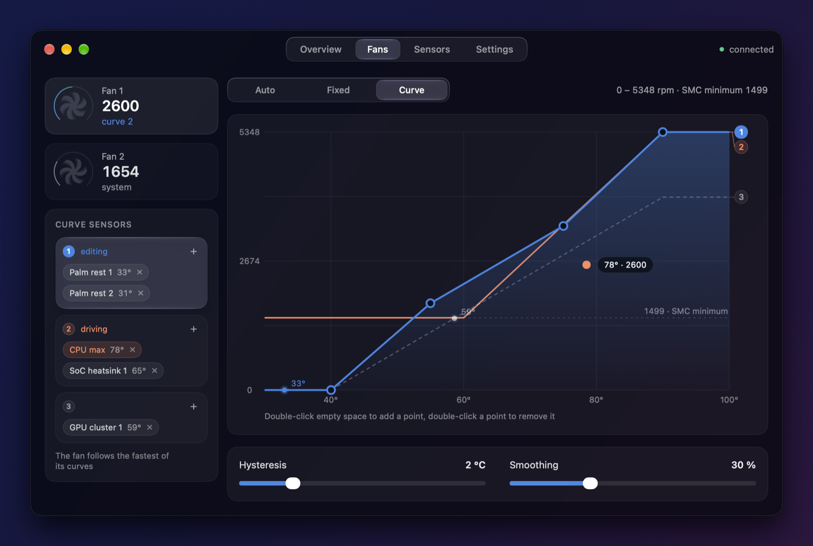
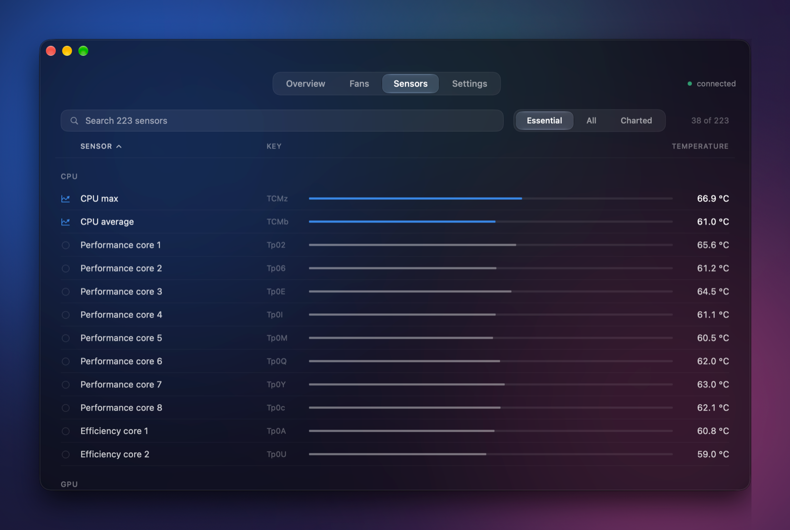
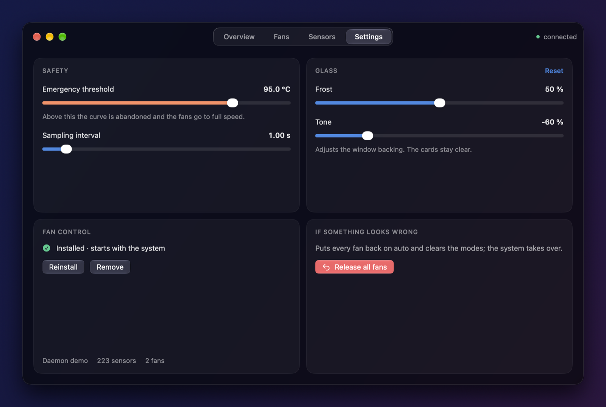
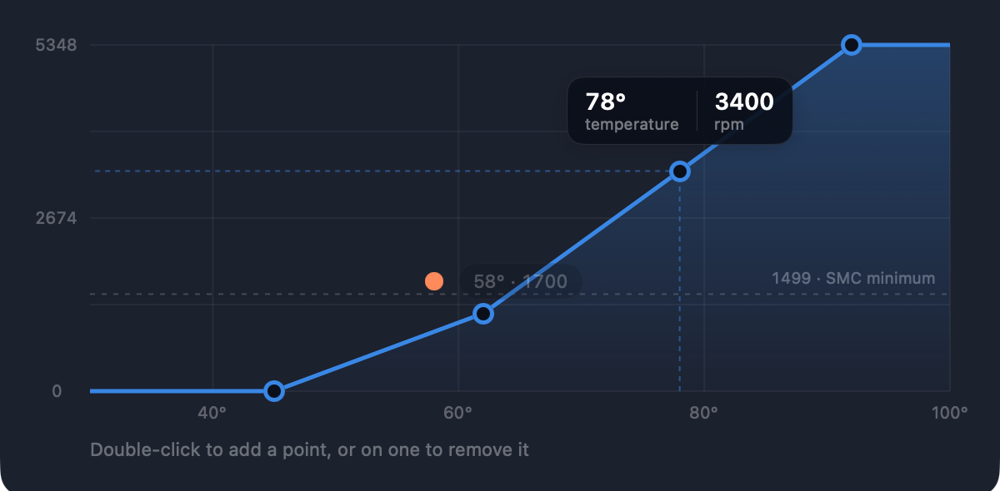
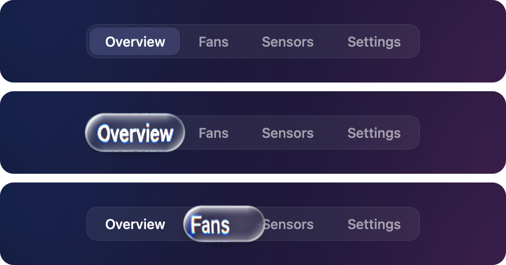

<p align="center">
  
</p>

<h1 align="center">GlassFan</h1>

<p align="center">
  Fan control and temperature monitoring for Apple silicon MacBooks,<br>
  built for macOS 26 and its Liquid Glass.
</p>

<p align="center">
  
  
  
  <a href="https://github.com/s1mptom/GlassFan/releases/latest"></a>
  <a href="https://github.com/s1mptom/GlassFan/actions/workflows/ci.yml"></a>
</p>

<p align="center">
  
</p>

GlassFan drives your MacBook's fans from temperature curves you draw, shows every
temperature sensor the SMC reports under a name you can understand, and keeps a
chart of the last half hour. It is in the spirit of Macs Fan Control, rebuilt from
scratch for macOS 26: a SwiftUI app on glass, and a small root daemon that does the
actual work.

## Features

- **Per-fan modes** — System (automatic), Fixed speed, or Curve. On M3 and later,
  taking a fan from the system takes five to thirteen seconds — the thermal manager has
  to let go first — and the interface says so rather than pretending to be in charge.
- **Curves you drag** — temperature against speed, with the point's exact values
  beside the pointer as you set it. A curve can go to 0 rpm: Apple silicon fans stop
  completely when told to, and run steadily well below the SMC's advertised minimum.
- **Driven by the sensors you pick** — a curve follows the hottest of any set of
  sensors, with hysteresis and smoothing so the fans do not hunt.
- **Every sensor, named** — all ~220 temperature keys, grouped (CPU cores, GPU
  clusters, memory, SoC heatsinks, SSD, battery, chassis, power, board). The
  essential 40–55 are shown by default, in a fixed order that does not jump around;
  sort by any column, search by name or key. On a chip with no table of its own the
  parts are read off the machine's key layout rather than left unnamed.
- **Live chart** — 5, 15 or 30 minutes of history, kept across daemon restarts and
  broken cleanly across sleep.
- **Menu bar** — both fans, the mode switch and the headline temperatures one click away.
- **Liquid Glass throughout** — adjustable frost and tone for the window, and a
  segmented control whose selection you can pick up like a drop of glass (below).
- **Safe by construction** — the app holds no privileges; if it *crashes* the fans stay
  managed, and if the daemon stops they go back to the system. Quitting GlassFan on
  purpose hands the fans back to the system and leaves your settings alone — they apply
  again the moment you open it. Closing the window is not quitting: the app stays in the
  menu bar and goes on doing its job.
- **Russian and English**, following the system language.

<table>
  <tr>
    <td></td>
    <td></td>
  </tr>
  <tr>
    <td align="center"><sub>Fans — modes, curve, the sensors that drive it</sub></td>
    <td align="center"><sub>Sensors — named, grouped, sortable</sub></td>
  </tr>
  <tr>
    <td></td>
    <td></td>
  </tr>
  <tr>
    <td align="center"><sub>Settings — safety, glass, the daemon</sub></td>
    <td align="center"><sub>Setting a curve point</sub></td>
  </tr>
</table>

## Compatibility

GlassFan needs **macOS 26 (Tahoe) or newer on Apple silicon**. The interface is
Liquid Glass throughout, and Tahoe is the last macOS for Intel Macs, so Intel is not
supported.

| Mac | Status |
|---|---|
| MacBook Pro 14"/16", **M1 Pro** or **M1 Max** (2021) | Supported. Built and tested on an M1 Max (MacBookPro18,2); the M1 Pro models share its SMC layout, fan keys and sensor map. |
| MacBook Pro 14"/16", **M3 Pro** (2023) | Supported. Measured on a Mac15,7 (16", 6+6 cores): 220 usable sensors, none unnamed. Fan control needs the `Ftst` unlock, which this does automatically — it takes a few seconds to engage. |
| Mac Studio, **M1 Max / M1 Ultra** | Should work: same chip family and sensor map. Not tested. |
| Apple silicon Macs, **other M2/M3/M4 chips** | Fan control uses the SMC's standard fan keys and the same `Ftst` unlock, both read from the machine itself; some M3 machines reportedly have no `Ftst` key, and there control works only while the system already wants the fans running. Sensors are all shown and named from the layout of the machine's own keys — cores, GPU clusters and heatsinks read as such, numbered rather than labelled. Not tested. |
| **MacBook Air** (no fan) | Temperature monitoring only — the app says the Mac is cooled passively. |
| Intel Macs | Not supported. |

Fans and their limits are discovered at startup (`FNum`, `F<n>Mn`, `F<n>Mx`), and
every sensor list is read off the machine, so nothing is hard-coded to one model.

### Naming sensors on a chip nobody has catalogued

Which part sits at which SMC key changes with every generation of Apple silicon, and
Apple documents none of it. There is no table anywhere that covers the current Macs:
[Stats](https://github.com/exelban/stats) has the M1 family right and its M3 entries
do not describe the M3 Pro measured here at all, and Asahi Linux — who reverse-engineered
the SMC protocol itself — label four temperature keys and say of the other 1,400 that
"mostly you have to guess based on the four-character name". Their driver describes
sensors per *machine*, because the keys differ even between two Macs with the same chip.

So GlassFan reads the machine instead of looking it up, in two ways that need no table
and no per-model testing:

**The key layout gives the structure.** The SMC lays each part out as a run of two or
three consecutive keys — probes first, the reading that leads them last — and cutting
the machine's own keys into those runs recovers the parts without knowing the chip —
on the M3 Pro measured, 17 zones of the CPU, 9 GPU clusters, 5 die zones and 4 SoC
heatsinks, where every one of them used to read "unnamed".

A run is only called a *core* when the machine agrees there are that many: `hw.physicalcpu`
says 12 here against 17 runs, so they are zones. On the M1 Max the two come to ten and
ten, and they are cores. Never "Performance core 3" — which core is which is not
something the SMC says.

**The machine's power meters give the subject.** macOS reports, unprivileged, what
each engine is spending second by second (IOReport's "Energy Model"). A sensor that
heats when the GPU spends and not when the CPU does is on the GPU, whatever its key
looks like. The daemon watches twenty minutes of ordinary use, regresses every sensor
on every engine at once — not one engine at a time, which lands every GPU sensor on
whichever engine is busiest — and names only what it becomes sure of. The answer is
kept in `engines.json` beside the config, tied to the machine, so it is learned once.
`fanctld --learn` shows the same working, out loud.

**Nothing is ever run to make this happen.** GlassFan puts no load on the Mac, warms
nothing on purpose and asks you to do nothing: the daemon was already reading the
sensors every second, and it now reads the power meters on the same tick. An ordinary
day drives the engines apart by itself — a build, a video call, a game — and that is
the whole experiment. On a Mac that is never busy, the engines stay quiet, no verdict
is reached, and the layout-derived names simply stand.

What this cannot do is tell a performance core from an efficiency one. The efficiency
cluster spends about a twentieth of what the performance cluster does, six cores away
on the same piece of silicon; three separate experiments could not pull the two apart
in the temperatures, and macOS offers no way to pin a thread to a core. A cluster this
code cannot tell apart is not one it labels.

## Download

Get **GlassFan.dmg** from the [latest release](https://github.com/s1mptom/GlassFan/releases/latest),
open it and drag GlassFan to Applications. No Xcode, no building.

Releases are not notarised by Apple yet, so macOS stops the app the first time it
opens (*"Apple could not verify GlassFan is free of malware"*). Open it once, then go to
**System Settings → Privacy & Security** and click **Open Anyway** next to GlassFan —
or run `xattr -dr com.apple.quarantine /Applications/GlassFan.app` in Terminal.

The app only shows temperatures until its helper is installed: open
**Settings → Fan control → Install**. macOS asks for your password once, and the
daemon starts with the system from then on. When a newer release carries a newer
daemon, the same place offers **Update**.

If another fan utility such as Macs Fan Control is running its privileged helper,
quit it first — both would write the same SMC keys.

To remove GlassFan, use **Settings → Fan control → Remove**, then delete the app.
The fans return to system control as soon as the daemon stops.

## Build from source

You need **Xcode 26** and its **Metal toolchain** (Xcode 26 ships the Metal compiler as
a separate component; the glass drop is a Metal shader):

```sh
xcodebuild -downloadComponent MetalToolchain
```

Then build the app:

```sh
git clone https://github.com/s1mptom/GlassFan.git
cd GlassFan
./Scripts/build-app.sh
open GlassFan.app
```

Then install the helper from **Settings → Fan control → Install**, as above.

<details>
<summary>Installing from the command line instead</summary>

```sh
./Scripts/install.sh      # builds the daemon, proves a fan responds, installs it
./Scripts/uninstall.sh    # stops the daemon, hands the fans back, removes it
```

`install.sh` forces a fan to a target and checks that it moves before installing
anything, and stops Macs Fan Control's helper if it finds it running.
</details>

### Releases

Pushing a tag like `v0.2.0` runs the [release workflow](.github/workflows/release.yml):
it tests, builds the app on a `macos-26` runner, packages a disk image and a zip with
checksums, and publishes them as a GitHub release. The same packaging runs locally:

```sh
./Scripts/package-release.sh 0.2.0     # → dist/GlassFan-0.2.0.dmg, .zip, SHA256SUMS.txt
```

With a Developer ID the workflow also signs with the hardened runtime and notarises,
and the "Open Anyway" step disappears for everyone. It needs these repository secrets:

| Secret | What it is |
|---|---|
| `DEVELOPER_ID_CERTIFICATE` | The *Developer ID Application* certificate and key, exported as `.p12`, base64-encoded |
| `DEVELOPER_ID_CERTIFICATE_PASSWORD` | The password of that `.p12` |
| `NOTARY_APPLE_ID` | The Apple ID of the developer account |
| `NOTARY_TEAM_ID` | Its team ID |
| `NOTARY_PASSWORD` | An app-specific password for that Apple ID |

## The glass drop

<p align="center">
  
</p>

macOS 26 gives the liquid lens — the drop you can push around a segmented control
on iOS — only to its own sliders and switches. GlassFan's segmented controls build
one: press anywhere and the selection lifts into a drop that follows the pointer,
stretches with speed and settles onto the segment you let go over.

It is modelled on the published breakdowns of Liquid Glass: a Metal shader refracts
what is under the drop through a bevelled rim by Snell's law, splits colour where the
rim bends hardest, frosts and mirrors at grazing angles, and lights the curve from a
fixed light that swings as the drop moves. Its position, width, lift and stretch are
four hand-stepped springs, so a click glides in one motion and a stalled frame pauses
the drop instead of making it jump. At rest none of it exists.

## How it is put together

The privileged part and the interface are separate programs:

| Target | What it is | Runs as |
|---|---|---|
| `CSMC` | Raw SMC access over IOKit. No policy. | — |
| `FanKit` | Curves, controller, sensor catalogue, config, wire protocol. No I/O, unit-tested. | — |
| `fanctld` | Control loop, safety watchdog, history, socket server. | root, via launchd |
| `GlassFanUI` | The SwiftUI interface, as a library so Xcode previews render. | — |
| `GlassFan` | The app: menu bar item and window. | you |

They talk over a unix socket at `/var/run/glassfan.sock` in newline-delimited JSON.
The app can be quit or crash at any time; the fans keep being managed. The transport
sits behind one protocol type, so moving to XPC and a signed `SMAppService` helper
later does not touch the engine.

## Safety

- Fans return to system control when the daemon exits, on `SIGTERM`/`SIGINT`, and
  when a fan is switched back to System.
- Any forced state left behind by another process is cleared at startup.
- A watchdog hands every fan back if the control loop stops ticking — and tells a
  stall from the machine simply having been asleep.
- Above the emergency threshold (Settings) the curve is abandoned and the fans go to
  full speed.
- **Settings → Release all fans** hands everything back at once.
- Manual control on M3 and later goes through `Ftst`, and **`Ftst` raised is the Mac's
  own thermal management switched off**. It is treated as borrowed, never taken: raised
  only while a fan is actually being held, dropped the moment none is, and dropped again
  on release, on quit, on a signal, by the watchdog, and at the next startup for whatever
  was killed before it could. `sudo fanctld --clear-lock` hands it back without needing
  the daemon that took it to still exist.

## Measured on the hardware

Checked on a MacBook Pro Mac15,7 (M3 Pro, 6+6 cores, 18-core GPU) on macOS 26.6,
not assumed:

- 220 usable temperature sensors, and **no memory sensors at all** — this chip
  reports no `Tm` keys, so the Memory group is simply absent.
- `Ts0*` reads with the SoC here (up 7–16 °C under a CPU load that leaves the flash
  keys `TH0x`/`TH0a`/`TH0b` half a degree *cooler*), where on the M1 family the same
  keys are the SSD. The M1 names are not reused for them.
- `Tf1*` and `Tf2*` are the SMC's own control, not sensors — and its two zones are the
  two **engines**, not the two fans, which the numbering suggests and loading each
  engine alone disproves: a CPU load moved `Tf1` by 14.0 °C and left `Tf2` within 3.7,
  a GPU load moved `Tf2` by 15.1 and `Tf1` by 5.1.
  `Tf16` (79.6 °C) is the CPU zone's setpoint and `Tf26` (82.4 °C) the GPU's, and both
  held through everything the machine was put through. They are shown beside the fans
  rather than in the sensor list, where they read as the two hottest things on the
  machine and can be picked to drive a curve that then never moves a fan. The gains and
  flags of the block (`Tf11`, `Tf15`, `Tf1C` and their `Tf2*` twins) are dropped.
- **`TCDX` is not a CPU aggregate.** It is the hotter of those two zones:
  `TCDX == max(Tf14, Tf24)` held across 138 samples in four experiments — to 0.2 °C in
  three of them and 0.7 °C in the fourth. Under a CPU load the CPU zone wins every
  sample; under a GPU load the GPU zone wins most of them, and `TCDX` and `Tf14` part
  by as much as 9 °C.
- **The SMC steers by a die zone, not by the hottest core**, which is why a warm
  machine can sit with its fans stopped: `TCMz` at 71.9 °C while `TCDX` read 48.6,
  thirty degrees below the 79.6 the controller acts at.
- Which cores are the performance ones is *not* established. Loading one cluster at a
  time — a default-QoS thread against a background-QoS one, three alternating rounds
  — heats the die as a gradient, not a split: the `Te` block and the `Tp0u`, `Tp0y`,
  `Tp3S` runs sit at the efficiency end every round and `Tp3O`, `Tp0U`, `Tp0a`,
  `Tp0g`, `Tp0m` at the performance end, but no boundary falls in the 6+6 the chip
  has. macOS cannot pin a thread to a core, so the cores are numbered, not labelled.
- The private IOHIDEventSystem route (usage page `0xff00`, usage 5) that some tools
  use for named Apple silicon sensors works unprivileged here but reports only
  `PMU tdie*`, `PMU tdev*`, `gas gauge battery` and `NAND CH0 temp` — no per-core
  names. It is not a shortcut to a sensor map.
- **Fan control needs an unlock on this chip, and `SMC_OK` was never the evidence.**
  `thermalmonitord` holds the fans in mode 3 and the firmware answers a manual-mode
  write with status `0x82`. That status lives in the SMC's own reply, which this
  project's C layer did not read — so every refusal looked like a success, and the
  interface said "fixed, 5349 rpm" over a stopped fan. The status is read now, and
  targets are read back besides.
  Raising `Ftst` asks the thermal manager to stand down; it takes 5 to 13 seconds to
  let go, measured across four runs. After that a manual target holds exactly:
  3000 rpm asked, 2977–3006 held over a minute. `Ftst` is raised only while a fan is
  actually being held and dropped the moment none is, because raised it is the Mac's
  own thermal management switched off. `fanctld --clear-lock` puts it back without
  needing the daemon that took it.
  The unlock mechanism is [agoodkind/macos-smc-fan](https://github.com/agoodkind/macos-smc-fan)'s,
  from decompiling `thermalmonitord` and `AppleSMC.kext`. Some M3 machines reportedly
  have no `Ftst` key at all; there the behaviour is what it was.
- **`F0Mn`, `F0Mx` and `Tf16` are read-only.** Writes to them return success and are
  discarded — they describe the fan and the SMC's setpoint rather than setting them.

Checked on a MacBook Pro 18,2 (M1 Max) on macOS 26/27, not assumed:

- 2 fans, `F0*`/`F1*`, reporting 1499–5348 and 1499–5776 rpm.
- The 1499 rpm minimum is advice. Asked for less, the fans settle and hold steady
  around 1200 rpm with no stalls; asked for 0, they stop.
- SMC reads work unprivileged; writes return `kIOReturnNotPrivileged` without root.
- 2251 SMC keys, 223 of them usable temperatures.
- `flt` is a little-endian IEEE float; `ioft` is 64-bit little-endian fixed point with
  16 fractional bits; the integer types are big-endian.
- `F0Md` is not a plain "forced" flag — the system writes its own values into it, and 3
  was seen while the fans were idle and stopped. The daemon used to track which fans it
  held rather than read the key back, which on this machine was harmless and on an M3 Pro
  hid a total failure; it now believes the hardware instead, by the SMC's own status byte
  and by reading the target back.

Sensor names come from cross-checking the open projects listed under
[Credits](#credits) against these machines — and, where they had nothing to say, from
the machine itself.

## Development

```sh
swift test                                   # FanKit and interface logic, no hardware
./.build/debug/fanctld --probe               # read-only hardware dump, no root
./.build/debug/fanctld --dump-sensors        # every temperature key with its name
./.build/debug/fanctld --learn 600           # which engine each sensor answers to
./.build/debug/fanctld --dump-fan-keys       # every fan key, type and value
sudo ./.build/debug/fanctld --clear-lock     # give the thermal management back
GLASSFAN_SOCKET=/tmp/gf.sock ./.build/debug/fanctld --dev   # unprivileged daemon for UI work
```

The hardware experiments behind everything under *Measured on the hardware*. They write
to the SMC, so they need root, and each puts back what it changed on every way out —
including on `SIGINT`:

```sh
sudo ./.build/debug/fanctld --unlock-test 3000 25    # the Ftst unlock, step by step
sudo ./.build/debug/fanctld --write-test Tf16 60     # is a key writable, and what moves
sudo ./.build/debug/fanctld --minimum-test --wait    # raise F0Mn, waiting for the window
sudo ./.build/debug/fanctld --selftest               # does a forced target move the fan
```

`--write-test` only writes keys on its own list, and refuses to raise a thermal
setpoint: lowering one asks for more cooling, raising one asks the Mac to run hotter
than Apple decided it should.

Open `Package.swift` in Xcode and pick the **GlassFanUI** scheme to see every screen in
previews, fed from a fixture.

## Credits

- Liquid Glass breakdowns this is modelled on: [Charles Grassi](https://charlesgrassi.dev/blog/apple-liquid-glass/),
  [kube.io](https://kube.io/blog/liquid-glass-css-svg/),
  [Ken Sorrell](https://www.sorrell.info/blog/liquid-glass-lens-effect),
  [Imad Rahmoune](https://imadrahmoune.com/liquid-glass/), and
  [LiquidGlassKit](https://github.com/DnV1eX/LiquidGlassKit)'s take on the iOS lens.
- SMC sensor research: [Stats](https://github.com/exelban/stats) and
  [iSMC](https://github.com/dkorunic/iSMC) for the M1 family's key map, and
  [Asahi Linux](https://asahilinux.org/) — whose
  [macsmc-hwmon](https://docs.kernel.org/hwmon/macsmc-hwmon.html) driver and its
  `hwmon-*.dtsi` fragments are the only labels here that come from reverse-engineering
  the SMC protocol itself. Their `TCHP = Charge Regulator` corrected a name this
  project had wrong on both chips.

## Disclaimer

GlassFan writes to your Mac's System Management Controller. It is careful about it,
but you use it at your own risk. Not affiliated with Apple.

---

<details>
<summary><b>Кратко по-русски</b></summary>

GlassFan — управление вентиляторами и мониторинг температур для MacBook на Apple
silicon, сделанный под macOS 26 и Liquid Glass.

- **Нужно:** macOS 26 или новее, Apple silicon. Проверено на MacBook Pro M1 Max и
  M3 Pro; MacBook Pro на M1 Pro устроены так же, как M1 Max (те же ключи SMC и
  датчики). На остальных чипах датчики называются по раскладке ключей самой машины:
  ядра, кластеры GPU и радиаторы читаются как таковые, но пронумерованы, а не
  подписаны. MacBook Air — только температуры. Intel не поддерживается.
- **Скачать:** GlassFan.dmg из [последнего релиза](https://github.com/s1mptom/GlassFan/releases/latest),
  перетащить в Программы. Релиз не нотаризован: при первом запуске откройте
  **Системные настройки → Конфиденциальность и безопасность → «Всё равно открыть»**
  или выполните `xattr -dr com.apple.quarantine /Applications/GlassFan.app`.
- **Собрать самому:** Xcode 26 и компонент Metal
  (`xcodebuild -downloadComponent MetalToolchain`), затем `./Scripts/build-app.sh`
  и `open GlassFan.app`.
- **Управление вентиляторами:** Настройки → Управление вентиляторами → Установить
  (macOS спросит пароль один раз).
- **Режимы:** Системный, Фиксированный, Кривая. Кривая может опускаться до 0 —
  вентилятор остановится.
- **На M3 и новее** забрать вентилятор у системы получается не мгновенно: сначала надо,
  чтобы отошёл штатный термоменеджер, это 5–13 секунд. Всё это время приложение честно
  показывает, что управления ещё нет, а не делает вид, что командует.
- **Безопасность:** механизм разблокировки на время выключает штатное терморегулирование
  мака, поэтому он берётся взаймы — только пока вентилятор реально удерживается, и
  снимается сразу, как только перестал, а также при выходе, по сигналу, по watchdog и при
  следующем запуске за того, кого убили. Вернуть управление системе немедленно:
  `sudo fanctld --clear-lock`.
- **Выход из приложения** возвращает вентиляторы системе, настройки при этом
  сохраняются и применяются снова при следующем запуске. Закрытие окна — не выход:
  приложение остаётся в меню-баре и продолжает управлять. Падение управление не снимает.
- **Датчики:** все ~220 с понятными названиями, основные показаны по умолчанию. Там, где
  готовой таблицы для чипа нет, названия выводятся из раскладки ключей самой машины и из
  её же счётчиков энергии — без нагрузки, просто наблюдением за обычной работой.

</details>
